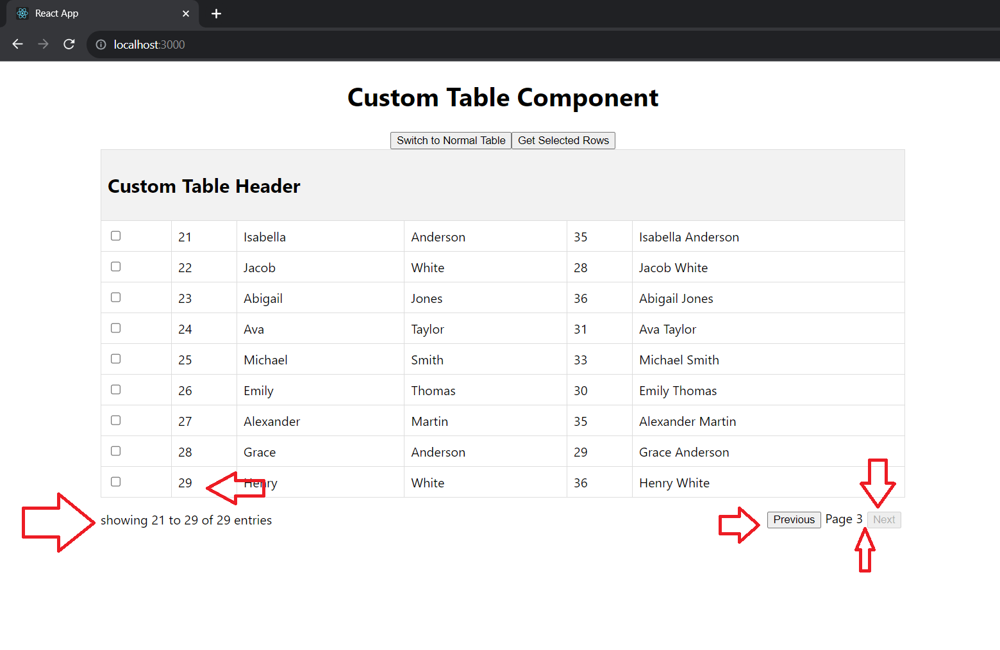
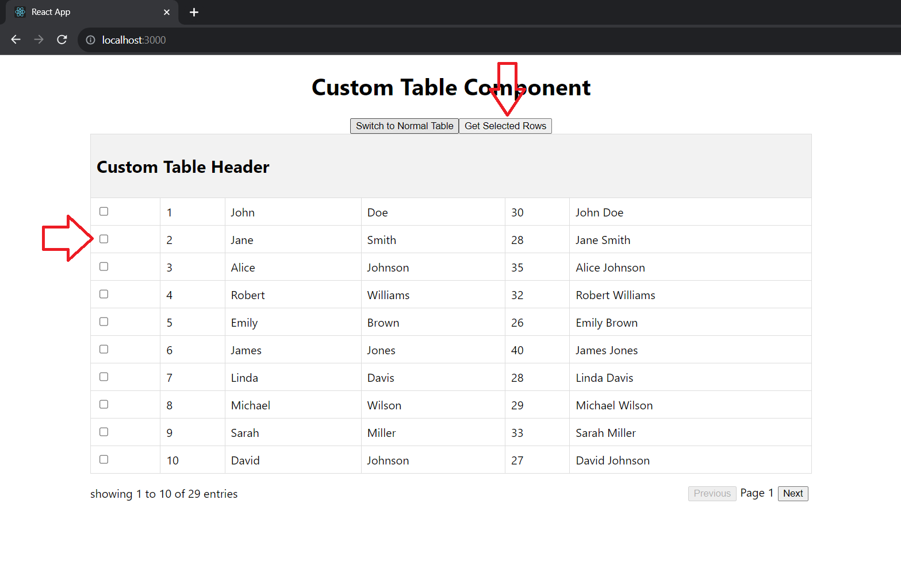
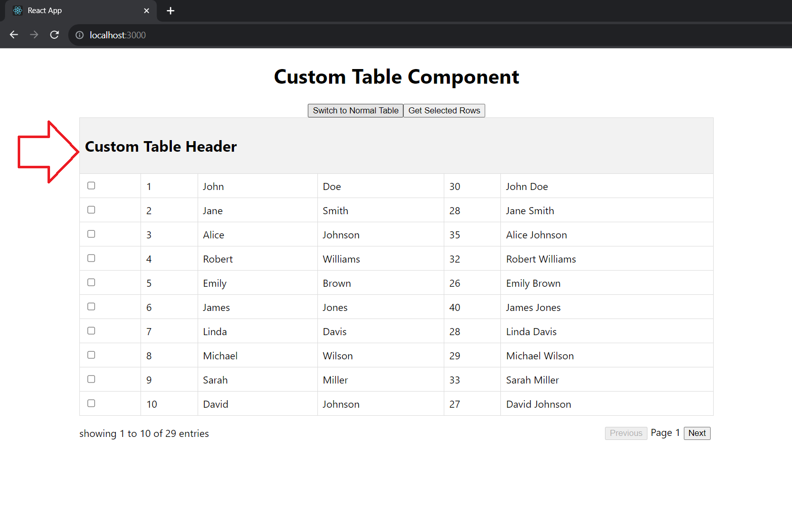
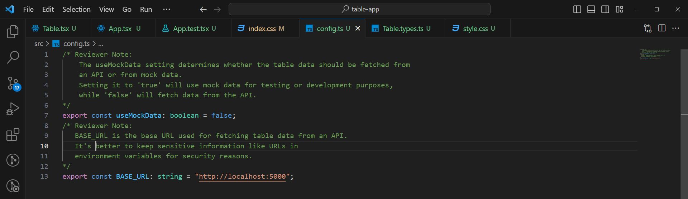

### Running the project

To run the Custom Table Component, you will need to start both the frontend application and the mock API server.

### Start the Frontend Application
`$npm start`
the application will run at: 
"http://localhost:3000."

### Start the Mock API Server:

This application uses json-server to simulate an API. You can start it by running the following command in a separate terminal window:
`$json-server --watch db.json --port 5000`
The mock API server will run at:
"http://localhost:5000"

### Features
The Custom Table Component offers several features to display and interact with data:

Pagination: Easily navigate through large datasets 

Row Selection: Select one or multiple rows in the table.

Custom Column Headers: Customize column headers with your desired content.

Mock Data or API Data: You can choose to use mock data by setting the useMockData configuration to true in the config.json file or use real API data by setting it to false.

### Use Mock Data

To use mock data in the application, follow these steps:
Open the config.json file.
Set the useMockData field to true
Save the file.

### Use API data

To use API data, set useMockData to false
>>>>>>> 1f71982db0c12d056e5f3f1282ab36df2c0e4507
